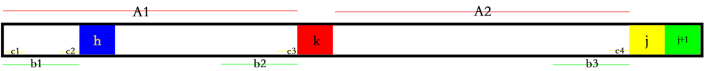

# 	KMP

## 入门第一发

相信，很多人入门的第一个算法(除去贪心等基本思想)，所以，先来略略领会一下dp的奥妙和人类的脑洞叭。

### 字符串匹配问题：

一类在一个字符串中查找其他字符串出现情况的问题。称被匹配的串为**主串**；称在主串中寻找匹配位置的串为**模式串**。

其按模式串个数分为**单模**匹配和**多模**匹配问题。而KMP是一种利用 LBorder 来高效解决单模匹配的算法。

**单模匹配问题**：给定两个串 $n$ 和 $m$ ，求 $m$在 $n$ 中出现的所有位置。

字符串 $s$ 的公共前后缀（即：$s[i]=s[len-i]$）称作Border。空串与原串也是 Border。

**非原串**的最长的 Border 称作 **LBorder** (Longest Border)。

LBorder 的性质使得 KMP 算法在匹配失败时能够直接按 LBorder 将主串与模式串重新对齐并继续尝试匹配，从而有效避免了暴力做法中盲目试错的过程。

## 预处理

为模式串建立 $next$ 数组，$next[i]$ 表示当模式串匹配到第 $i$ 位失配时应该从哪一位开始匹配。

注意，$next[0]$ 和 $next[1]$ 不存在Border(一共长度没有 $2$，上哪来的两个子串？)，因此根据其意义规定为 $next[0]=next[1]=0$，在这两位失配时均从头开始匹配。

而构建 $next$ 数组，运用了一点dp的思想，即尽可能的使用现有的去推导已知的。



上图演示：当我们求 $next[j+1]$ 时，已经知道 $next[0]\sim next[j]$ 的值。

1. 首先，我们判断 $j+1=k$，若成立则 $next[j+1]=next[j]+1$ 并退出，若不成立执行第 $2$ 步。
2. 再次判断 $j+1=h$，若成立则 $next[j+1]=next[k]+1$ 并退出，若不成立执行第 $3$ 步。
3. 接着判断……

那么，问题来了，问什么我们这样做是对的呢？~~(这题我A了，但是为什么？)~~

看上图，方块表示对应位置的字符，每条颜色对应的横线是相等的子串(其实就是之前求出的LBonder)。

1. 因为 $A_1=A_2$，因此 $next[j]=k$。如果 $j=k$，则 $next[j+1]$ 应该指向 $k+1$ 位(LBonder的长度为 $A_1+第k位$)。

2. 若上面的没匹配到，则因为 $A_1=A_2\space\&\space b_1=b_2$，我们可以推导出 $b_1=b_3$，这样，我们又重复了上面的那个问题，所以一样的方法再做一遍即可。
3. 我们推导可知， $c_1=c_2=c_3=c_4$，所以继续……

下面，我们上代码！

因为通常起始位置可能是下标 $0$ 或者是下标 $1$，构建的时候可以目标第 $j$ 位或者第 $j+1$ 位；因此，经过组合数的计算，我们一共有 $4$ 种代码。

从 $0$ 开始目标 $j$ 位：

```c++
inline void get_next(char *in, int *next)
{
    int len = strlen(in);
    next[0] = next[1] = 0;
    for (int i = 2; i <= len; i++)
    {
        int now = next[i - 1];
        while (now && in[now] != in[i - 1])
            now = next[now];
        next[i] = in[i - 1] == in[now] ? now + 1 : 0;
    }
}
```

从 $0$ 开始目标 $j+1$ 位 ：

```c++
inline void get_next(char *in, int *next)
{
    int len = strlen(in);
    next[0] = next[1] = 0;
    for (int i = 1; i < len; i++)
    {
        int now = next[i];
        while (now && in[now] != in[i])
            now = next[now];
        next[i + 1] = in[i] == in[now] ? now + 1 : 0;
    }
}
```

从 $1$ 开始目标 $j$ 位：

```c++
inline void get_next(char *in, int *next)
{
    int len = strlen(in);
    next[1] = next[2] = 1;
    for (int i = 3; i <= len; i++)
    {
        int now = next[i - 1];
        while (now > 1 && in[now] != in[i - 1])
            now = next[now];
        next[i] = in[i - 1] == in[now] ? now + 1 : 1;
    }
}
```

从 $1$ 开始目标 $j+1$ 位：

```c++
inline void get_next(char *in, int *next)
{
    int len = strlen(in);
    next[1] = next[2] = 1;
    for (int i = 2; i < len; i++)
    {
        int now = next[i];
        while (now > 1 && in[now] != in[i])
            now = next[now];
        next[i + 1] = in[i] == in[now] ? now + 1 : 1;
    }
}
```

## 开始匹配

而接下来的匹配就很好搞了，只要一失配就跳next即可。这样，可以做到主串的 $i$ 不会退，提高了效率。

[洛谷 P3375 【模板】KMP字符串匹配](https://www.luogu.com.cn/problem/P3375)

```c++
#include <cstdio>
#include <cstring>
const int maxe = 1e6 + 9;
char a[maxe], b[maxe];
int nxt[maxe], na, nb;
inline void get_next(char *in, int *next)
{
    int len = strlen(in);
    next[0] = next[1] = 0;
    for (int i = 2; i <= len; i++)
    {
        int now = next[i - 1];
        while (now && in[now] != in[i - 1])
            now = next[now];
        next[i] = in[i - 1] == in[now] ? now + 1 : 0;
    }
}
int main()
{
    scanf("%s%s", a, b);
    na = strlen(a);
    nb = strlen(b);
    get_next(b, nxt);
    for (int i = 0, j = 0; i < na; i++)
    {
        while (j && b[j] != a[i]) //不断失配跳转
        {
            j = nxt[j];
        }
        if (b[j] == a[i])
            j++;
        if (j == nb)
        {
            printf("%d\n", i - j + 2);
        }
    }
    for (int i = 1; i <= nb; i++)
    {
        printf("%d ", nxt[i]);
    }
    return 0;
}
```

## 字符串最小循环节

**证明：字符串最小循环节 = 字符串长度 - LBonder(尾部next数组)**

假设字符串 $a$ 是其子串 $b$ 循环 $k$ 次在加一个 $b$ 的前缀 $d$ 得到，$a$ 串的LBonder长 $x$，则我们思考一个问题：

前 $k-1$ 个 $b$ 加一个 $d$ 等于后 $k-1$ 个 $b$ 加一个 $d$。举个栗子：

| **a**  |   a   |   b   |   c   |   a   |   b   |   c   |   a   |   b   |
| :----: | :---: | :---: | :---: | :---: | :---: | :---: | :---: | :---: |
| **b**  | **a** | **b** | **c** |       |       |       |       |       |
| **前** | **a** | **b** | **c** | **a** | **b** |       |       |       |
| **后** |       |       |       | **a** | **b** | **c** | **a** | **b** |

我们发现，前 $k-1$ 个 $b$ 加一个 $d$ 等于后 $k-1$ 个 $b$ 加一个 $d$ 等于 LBonder！

所以，$b$ 的长度就是(看上表) $a$ 串的长度 - 后 $k-1$ 个 $b$ 加一个 $d$ 的长度 = $a$ 的最小循环节

所以，字符串最小循环节 = 字符串长度 - LBonder(尾部next数组)。

 
